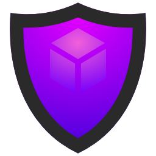

# Immunity Engine

Immunity is an open source game engine that aims to provide immunity to your game, team, company, and industry from the whims of others. Don't put your future at risk by being dependent on companies that could pull the rug out from under your feet. As the saying goes; fool me once, shame on you. Fool me twice, shame on me.

Immunity. [im] *prefix*: not. [unity] *name*: :poop:

Get involved; fork the repo, enhance it, and contribute back to pay it forward.

## High-level goals of the Immunity Engine

* An engine for games that are unencumbered by other companies' business models
* To stand on the shoulders of other great open source projects
* Created by industry veterans, for the industry
* Develop in parallel with commercial games
* Scalable from solo indies to AAA teams
* High developer quality-of-life
* Fast iteration the entire team
* Integrated with professional tools
* Modern architecture (data-oriented design, threaded and advanced job/task system, ECS, etc.)
* Modern features
* Cross-platform
* Extensible
* Performance by design, by default

## What the Immunity Engine is not

* Not designed to be your first engine
* Not expected to have every feature your project needs
* Not ready to ship games with out of the box (yet!)
* Not targetting low-end or niche platforms and not strictly targetting the high-end either (i.e. there's a realistic min-sepc)
* Not commercial. It's up to you to pay it forward. Your next project will be easier if we all do it
* Some (optional) professional features are necessarily behind commercial paywalls or NDA's

## Support

Use [GitHub Discussions in the main repo](https://github.com/richard-sim/immunity/discussions) for support, to support others, and to discuss features.

## Getting started

### Syncing the repo for the first time

* [Fork the Immunity Engine repo in Github](https://github.com/richard-sim/immunity/fork), do not simply clone it. You will be customizing and extending the repo, and a fork is needed to contribute back your fixes and improvements.
* Ensure that you have the Git LFS extensions installed.
* The repository makes use of submodules for dependencies, so you must clone your fork recursively. e.g. `git clone --recursive https://github.com/YOUR_NAME/immunity.git`
* Add the upstream repository as a remote. e.g. `git remote add upstream https://github.com/richard-sim/immunity.git`
* Do not ever make changes in your forks 'main' branch; keeping it pristine will make updating your fork in the future much less painful. Instead, set up a local 'namespaced main' branch and do all your work from there ('YOUR_NAME' is referred to in git as the namespace of the branch 'YOUR_NAME/foo').
* Create and checkout your 'namespaced main' branch: `git checkout -b YOUR_NAME/main main`

### Working with the upstream repo

#### Getting the latest updates

* Check that the upstream repo is present: `git remote -v`. If not, add it as per *Syncing the repo for the first time* above.
* Fetch the upstream changes: `git fetch upstream`
* Ensure you're on the 'main' local branch: `git checkout main`
* Merge the upstream changes with your fork: `git merge upstream/main`. If you haven't made any changes (you shouldn't have, see *Syncing the repo for the first time* above), this should simply perform a fast-forward and not require actual merging.
* Go back to your 'namespaced main' branch: `git checkout YOUR_NAME/main`
* Rebase your 'namespaced main' on the latest changes you got from the upstream repo: `git rebase main`
* After resolving any conflicts that arose, run `git submodule update --init --recursive` to update the dependencies.

#### Merging changes back upstream

* Follow *Getting the latest updates* above and resolve any merge conflicts that may arise.
* We will create a new topic branch exclusively for these changes, as GitHub will continuously update the PR to track all subsequent changes in the branch. For further details please read [the Pro Git chapter](https://git-scm.com/book/en/v2/Distributed-Git-Maintaining-a-Project#_working_in_topic_branches) on working with topic branches, integrating changes, and various workflows.
* Create a new topic branch based off of 'main', not your 'namespaced main', as it should only include the specific changes that you want to merge. Namespace it under 'YOUR_NAME/PR/': `git checkout -b YOUR_NAME/PR/CHANGES_NAME main`
* Specify commits (or branches) that should be included in your topic branch by cherry-picking them: `git cherry-pick COMMIT_HASH`
* Re-test your changes in the topic branch against the latest upstream changes and make and required changes in the topic branch. Fixes may later be included back in your other branches by cherry-picking also.
* Push your changes to GitHub: `git push origin YOUR_NAME/PR/CHANGES_NAME`
* In your browser, go to the page for your fork on GitHub (e.g. `https://github.com/YOUR_NAME/immunity`), select the `YOUR_NAME/PR/CHANGES_NAME` branch, and click the `Pull Request` button.
* If you need to make any adjustments to your pull request, merge them back into the `YOUR_NAME/PR/CHANGES_NAME` branch (or make the changes there in the first place) and push the changes to GitHub again. Your pull request will automatically track the changes on the branch and update.

#### Git workflow best practices and references

* [Pro Git](https://git-scm.com/book/en/v2/Distributed-Git-Maintaining-a-Project#_working_in_topic_branches)
* [Gist #1](https://gist.github.com/james-priest/74188772ef2a6f8d7132d0b9dc065f9c)
* [Gist #2](https://gist.github.com/Chaser324/ce0505fbed06b947d962)

* [`git cherry-pick` documentation](https://git-scm.com/docs/git-cherry-pick)

## Features behind paywalls

Some professional features of the Immunity Engine are necessarily behind commercial paywalls as they use products that require purchasing or licensing separately, at your own expense. All such features are optional and disabled by default, and Immunity Engine is fully functional without them. We do this so that we can provide the best experience for professionals in the industry, where such features are expected. Where possible, there are corresponding built-in features included that do not require separate purchases or licensing.

* Console development (Xbox, Playstation, etc.)
  Immunity Engine can be used to develop for desktop, web, and mobile platforms if you are not a licensed console developer.
* Hot reloading and code patching with Live++
  Immunity Engine use built-in support for hot reloading assets (meshes, textures, animations, etc.).
* Advanced performance profiling with Superliminal Performance
  Immunity Engine has a simple built-in profiler that can be used for basic performance analysis.

## License

Immunity Engine is licensed under the permissive Apache Licence 2.0, to provide assurance to its users (you!) that they can use the code unencumbered by patent issues from its authors. Otherwise, this license provides similar freedoms to the MIT and BSD 2-Clause licenses. It is not necessary to release the changes you make to the Immunity Engine nor your own projects that use it, but contributing fixes, improvements, and features back is greatly appreciated and helps everyone.

[Apache License 2.0 at tl;drLegal](https://www.tldrlegal.com/license/apache-license-2-0-apache-2-0)

[Apache License 2.0 at Choose a License by GitHub](https://choosealicense.com/licenses/apache-2.0/)

[Apache License 2.0](https://apache.org/licenses/LICENSE-2.0.txt)

[Apache's License FAQ](https://apache.org/foundation/license-faq.html)

### Dependencies

Immunity Engine is built on the shoulders of other great open source projects, and as such those dependencies have their own licenses. All dependencies do also have permissive licenses however, such as the MIT License or the BSD 2-Clause license.
